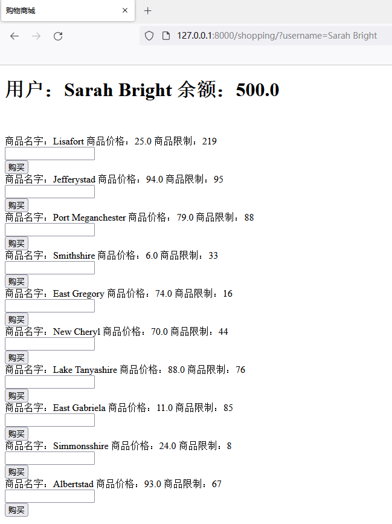
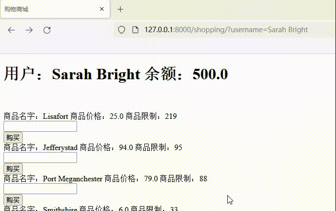
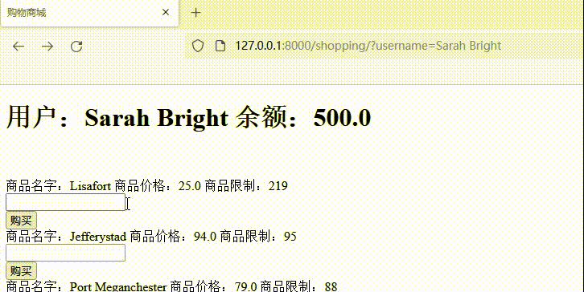
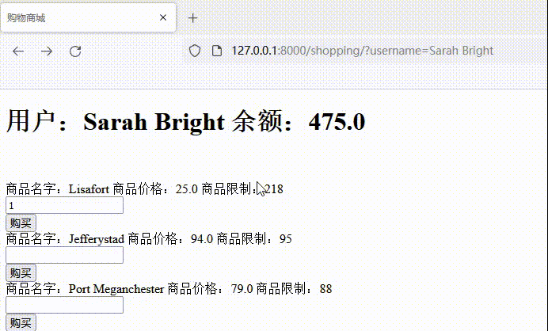
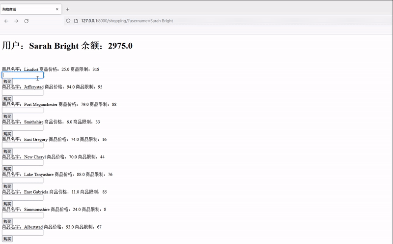

# 支付漏洞

## 正常流程

Sarah Bright用户，有余额500。

访问购买页面

当购买商品数量超过限制会提示

当不够钱的时候会提示

购买成功，会看到数量和金额都相应减少。

## 购买数量篡改

 将商品数量修改为负数，即可负负得正，从而达到**加钱**效果。

## 付款金额篡改

`price`参数没有做校验， 可以传入负数，即可负负得正，从而达到**加钱**效果。

