# 验证码


## 短信验证码横向轰炸

对手机号123457发送短信

```
http://127.0.0.1:8000/msg_code/?phone=123457&attack_type=horizontal
```

一直对该接口进行不断请求即可发送短信验证码。

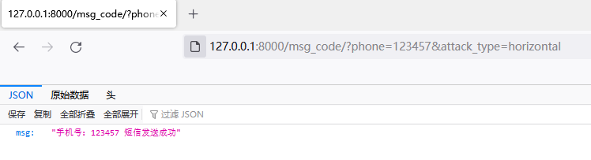


**演示GIF：**

使用burp重放100次请求，都可以返回短信发送成功的信息。

![[video-to-gif output image]](img/ezgif-4-7d657211fe.gif)

## 短信验证码纵向轰炸


```
http://127.0.0.1:8000/msg_code/?phone=123457&attack_type=vertical
```

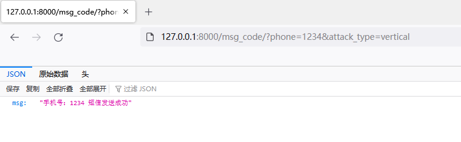

再次访问会提示需要一分钟才可以再次发送

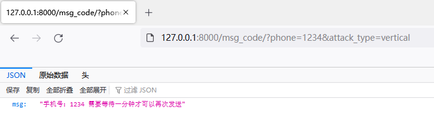


那我换成另外一个手机号即可再次发送

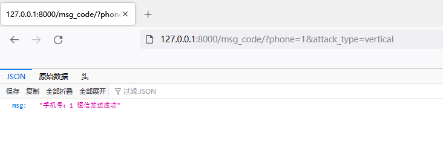

演示GIF：

![[video-to-gif output image]](img/ezgif-4-597f7d528e.gif)


## 短信验证码泄露

漏洞URL：

```
http://127.0.0.1:8000/msg_code/?phone=123457&attack_type=leak
```

后端会将短信验证码返回

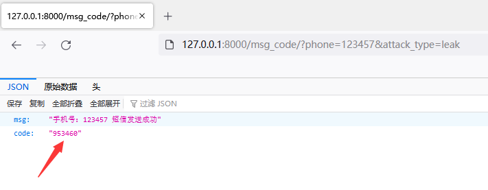

## 短信验证码不失效


短信验证码在**单位时间**或者**使用完成后**没有进行**销毁**，导致漏洞产生。常用于**暴力破解短信验证码**，伪造用户进去业务系统。

首先先获取短信验证码

```
http://127.0.0.1:8000/msg_code/?phone=123457&attack_type=horizontal
```

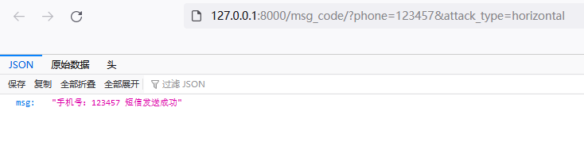

访问短信验证码校验接口，会提示报错

```
http://127.0.0.1:8000/msg_code/?phone=123457&attack_type=nofail&code=438163
```

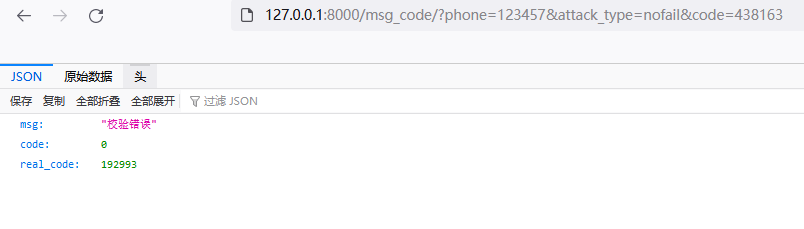

然后将`real_code`参数的短信验证码替换`code`参数里面，即可验证成功。

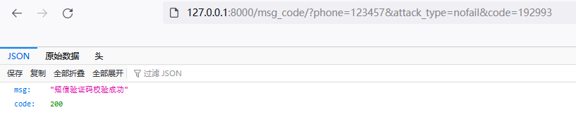

演示GIF：

![[video-to-gif output image]](img/ezgif-3-a403ac66ac.gif)

## 短信验证码绕过

开发没有对`code`参数进行类型校验，一旦`code`为空值就可以绕过流程。

漏洞URL：

```
http://127.0.0.1:8000/msg_code/?phone=123457&attack_type=noauth&code=438163
```

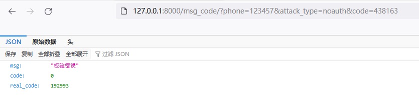


将`code`参数删掉，即可绕过校验

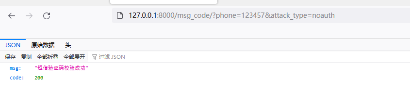


演示GIF：

![[video-to-gif output image]](img/ezgif-3-fbd5d08174.gif)


## 短信验证码写死

测试人员在测试环境方便短信流程测试，会设置一个通用验证码，如123456、888888。这块校验流程也同步到生产环境，导致使用一个短信验证码即可访问所有用户账号。

随便输入一个短信验证码就会提示校验错误。

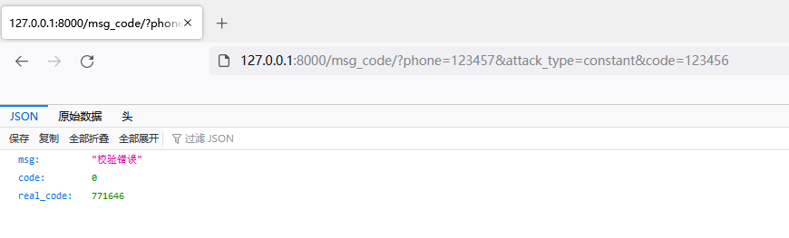

这时候，对短信验证码已经爆破成功`888888`，可以看到该验证码对所有手机号是通用。

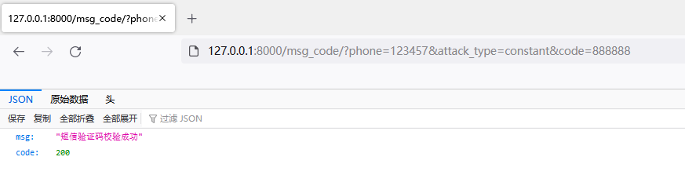

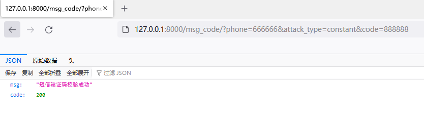

演示GIF：

![[video-to-gif output image]](img/ezgif-3-53dc075be0.gif)
